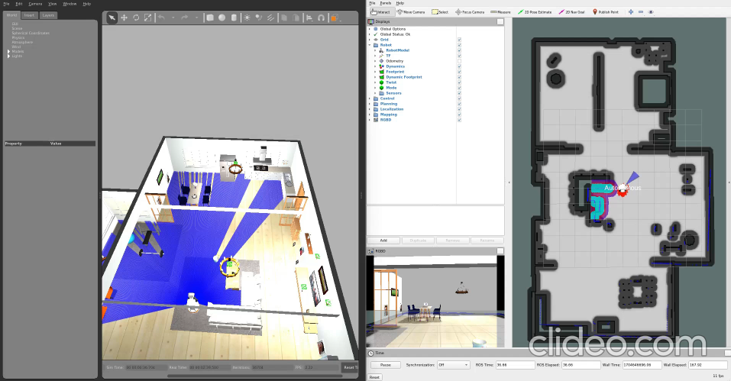
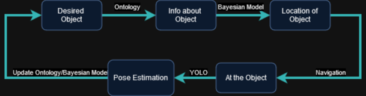
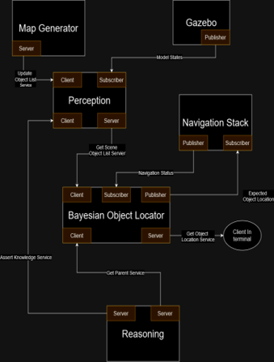

# SSY236 Final Project - Group 2: Robot Navigation Based on a Bayesian Classifier

The project is to use a probabilistic classifier and logic to navigate towards an object and find them. The expected pipeline is shown in the image below:
<!-- PROJECT LOGO -->
<br />
<div align="center">
  <a href="">
    
  </a>


  <p align="center">
    <br />
    <a href="./SSY236_presentation_group2.pptx">Explore the docs</a>
    ·
    <a href="https://youtu.be/jShlLz6bswQ">View Demo</a>
  </p>
</div>




</p> 
Watch the demonstration video： https://youtu.be/jShlLz6bswQ
</p>
----- You can click on the image directly to jump to the video interface.

[](https://youtu.be/jShlLz6bswQ)


1. The robot recieves an object that the user wishes it would find.
2. The robot uses its knowledge base and logic defined in Protege and Prolog to determine what type of thing the object is, and list of possible places it can be found.
3. The robot then uses a Bayesian classifier to determine which of these places are most likely to be the actual place it is.
4. The robot navigates close to the most likely place.
5. The robot searches for the object and finds it. If the object is not found, use the next most likely location and repeat from step 4.
6. Use object recognition and estimate object's pose. Update your KB and classification model as approprate, and wait for next instruction.

## Project structure

The project is mostly contained in the `bayesian_object_finder` ROS package. Some helper packages are also available in this repository such as the world the simulation is in. Some of the launch files used for the Tiago robot is moved to this repository due to the need for some small changes.

## Architecture of this ROS package/Project

<p float="left">
   
</p>

## Cloning this repo

To clone this repo, choose the workspace you want to store the repository in, then clone this repository within the `src` folder.

For example:

```
cd path_to_catkin_workspace/src
```

then clone this repository. If you are getting asked to put in a password, or are getting access/permission errors, you need to add/update an SSH key to your GitLab profile.

## Running the simulation

To run the simulation, run the following:

```
(navigate to the workspace this repository is in)
source /tiago_public_ws/devel/setup.bash
catkin_make
source devel/setup.bash
roslaunch bayesian_object_finder start_prototype.launch
```

In another terminal, run the following:

```
source devel/setup.bash
rosservice call /get_obj_location "obj_name: 'desired_obj_name'"
```

it is important that `desired_obj_name` be written as it is in the ontology, otherwise it will not work. Keep in mind to only call children/subclasses of `RequestableObject`. There are two objects in the world that you can attempt to find: `Cup`, or `Plate`. `Plate` is found at both most likely locations, but `Cup` is not. This is to showcase all expected cases of this project. If `RequestableObject` cannot be reached from the provided object name (i.e. not reachable from the object), the service will return false and the chain would not continue.

## Limitations of this project:

1. System does not keep track of where it found previous objects, so it does not update the probability distributions.

2. Naive bayesians were not used due to the fact that the different objects/locations are not independent from each other.

3. While the system creates different instances, it does not use different attributes of the instances to differentiate specific instances from each other. This means that if e.g. plate or orange has been found once, requesting it again would simply lead to it being immediately found.

4. Uses proximity based "object recognition" so it does not need to orient itself such that it faces the object it wants to find. This additional step would complicate the process/pipeline

5. Locations only specified in the kitchen but can very easily be expanded to include every room.

6. Use of non-optimized gaussian processes makes system slow, but only when deciding. (can switch to GPytorch in `bayesian_classifier.py` for improved performance)

7. Have to keep training data minimal due to lack of optimization (speed of gaussian process depends on size of training data.) GPs usually have O(N^3) where N is the size of the training data, so it is highly inefficient when using large datasets. There are many optimisation methods however.

8. No safeguard implemented for when a navigation goal is within in obstacle, can cause robot to get into a deadlock and can only be saved if a timeout occurs.

9. System does not learn about new locations/new objects. Can be added to Prolog/ontologies in future projects.

